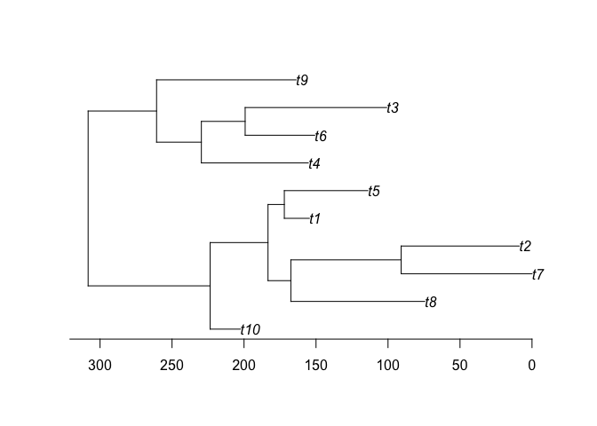
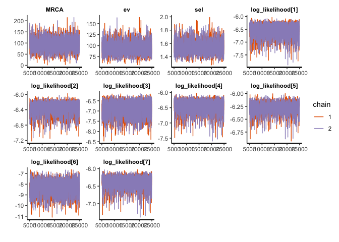

# "BSDSモデルによる方向性淘汰圧の推定"
author: "Ph.D. Ohkubo Yusaku (ROIS-DS & Institute of Statistical Mathematics) {y-ohkubo[--]ism.ac.jp}"<br>
date: "Mar.9 2021"


## Introduction
枝特異的方向性淘汰モデル(branch-specific directional selection; 以下、BSDS)は種間系統比較法(phylogenetic comparative method)の一種で、系統樹における一部の枝で方向性淘汰を経た生物の形質を分析するために開発されました。
このドキュメントでは、仮想の形質データを題材にRとStanで実際にBSDSモデルを使ってマクロ進化の分析を実行する方法について紹介します。
__なお、BSDSモデルをランダム効果として使った回帰モデル(BSDS-LMM)を実行するには以下のページを参照してください。__

https://github.com/OhkuboYusaku/PCM_BSDS/tree/main/example/BSDS_LMM

## 下準備/ Preparations
### 必要パッケージのインストール/ Installing the required packages
このコードでは、{ape},{rstan}の2つのパッケージに依存しています。事前にインストールし、読み込んでおきます。

The following code depends on {ape} and {rstan}. Install and load them.
```r
install.packages(c("ape", "rstan", "dummies"))
```


```r
library(ape)
library(rstan)
```

Stanのインストールがうまくいかない場合は、下記の公式ドキュメントを参照してください。
https://github.com/stan-dev/rstan/wiki/RStan-Getting-Started-(Japanese)

If failed to install Stan, please ask the following official document.
https://mc-stan.org/users/interfaces/rstan


### 必要な関数の定義/ Definition of the required R-function
BSDSモデルをStanで実行するには、各個体の形質値、種名のインデックス、系統樹のトポロジーと枝長、など多くのデータを受け渡す必要があります。そこで、これらのデータを一括してStanに渡すリスト形式に変換できるようあらかじめ関数を定義しておくと便利です。

When the BSDS is applied, Stan needs the individual trait data, the index of each spiecies, the topology and the branch-length of the phylogenetic tree. The following function is usefull convert them as a single object.

```r
# define data-arrangement function
BSDS2stan_data<- function(phylo, y, Z, D_edge){
  len_phylo<- length(phylo$edge.length)
  N_tip<- len_phylo - phylo$Nnode +1
  branch_len<- phylo$edge.length
  tree_obj<- as.matrix(phylo$edge)
  MRCA_ij<- matrix(0, N_tip, N_tip) ## i,j elements correspond to the location of their MRCA in the tree
  
  for(i in 1:N_tip){
    for(j in i:N_tip){
      MRCA_ij[i,j]<- MRCA_ij[j,i]<- getMRCA(phylo, tip=c(i,j))
    }
  }
  
  dat<- list(N=length(y), N_sp=N_tip, 
             len_phylo=len_phylo, branch_len=branch_len, tree_obj=tree_obj, MRCA_ij=MRCA_ij,
             y=y, Z=dummies::dummy(Z), DS_edge=DS_edge)
  
  return (dat)
}
```


## 実行例/ Run
### データの読み込み/Import data
まず、題材となるデータを読み込み、構造を確認します。

First, we import data and check its structure.

```r
data<- read.csv("BSDS_sample.csv")
summary(data)
```

```
##        X                Y              sp_ID     
##  Min.   :  1.00   Min.   :-735.9   Min.   : 1.0  
##  1st Qu.: 25.75   1st Qu.: -51.4   1st Qu.: 3.0  
##  Median : 50.50   Median : 108.4   Median : 5.5  
##  Mean   : 50.50   Mean   : 260.9   Mean   : 5.5  
##  3rd Qu.: 75.25   3rd Qu.: 355.5   3rd Qu.: 8.0  
##  Max.   :100.00   Max.   :2002.6   Max.   :10.0
```

```r
Y<- data$Y
sp_ID<- (data$sp_ID)
```

Yに各個体(i=1,2,...N_sample)の形質値、sp_IDに各個体の種ID(1,2,...N_sp)を格納しています。

Y contains individual trait data and sp-IC contains the spicies ID of them.

次に系統樹を読み込みます。ここでは、{ape}パッケージの関数を用いてNewick形式で記録された系統樹を読み込みます。

Next, we import the phylogenetic tree. Here, we use {ape} package to load Newic-formated tree.

```r
phylo<- read.tree("BSDS_tree")
plot(phylo)
axisPhylo()
```

<!-- -->

```r
phylo$edge # tree構造:[,1]の親種から[,2]の子孫種へエッジが伸びている
```

```
##       [,1] [,2]
##  [1,]   11   12
##  [2,]   12    1
##  [3,]   12   13
##  [4,]   13   14
##  [5,]   14    2
##  [6,]   14   15
##  [7,]   15    3
##  [8,]   15    4
##  [9,]   13   16
## [10,]   16    5
## [11,]   16    6
## [12,]   11   17
## [13,]   17   18
## [14,]   18    7
## [15,]   18   19
## [16,]   19    8
## [17,]   19    9
## [18,]   17   10
```

また、方向性淘汰が生じたと思われる箇所を指定します。例えば、「原生種t1が、t5との共通祖先(sp12)と分岐した直後から方向性淘汰を受けるようになった」と仮定します。この場合、phylo$edgeにおいて「sp12からsp1」に伸びる枝、すなわち[2,]が該当する箇所になります。


```r
DS_edge<- 2
```


最後に、これらのデータを先の関数でリスト形式に変換します。

Convert them to a list format.

```r
dat<- BSDS2stan_data(phylo, Y, sp_ID, D_edge)
```

### Stanの設定
Stanコードのファイル名を渡し(scr)、MCMCのサンプリング(ite)とwarmup(war)の回数、マルコフ連鎖の本数(cha)を指定します。

Designate the file name of the Stan code, the number of iterations, warmup, and the Mrkov chains.

parには、推定するパラメータを指定します(オプション）。

マルチコアCPUの場合、最後のオプションを有効にすることで並列計算を実行することができ時間の節約になります。

```r
scr<-"stan_BSDS.stan"
war<- 5000
ite<- 25000
cha<- 2
par<- c("MRCA", "ev", "sel", "log_likelihood")
options(mc.cores = parallel::detectCores())
```

### サンプリングの開始
いよいよ、MCMCで事後分布からのサンプリングを行います。

Sampling from the posterior.

```r
fit_BSDS<- stan(file = scr, model_name = scr, data = dat, pars = par, chains = cha, 
          warmup = war, iter = ite, thin = 10)
```
サンプリングの実行後にDivergent transitionやmaximum treedepthの警告が表示される際には、下記を参考にadapt_deltaなどを調節します。
https://mc-stan.org/misc/warnings.html#divergent-transitions-after-warmup

## 結果の出力
__MCMCが収束していることを保証するため、必ずtraceplot()やR_hatを確認しましょう。__
print()関数で、R_hatも含めた要約統計量の一覧を得ることができます。

```r
print(fit_BSDS)

```


 ```r
 traceplot(fit_BSDS)
 ```

 ```
 ## 'pars' not specified. Showing first 10 parameters by default.
 ```

 <!-- -->
 
その他{shinystan}では、マルコフ連鎖の診断や事後分布の可視化など優れたツールを提供しています。


## References
大久保, 沓掛, 小泉 (2021)."枝特異的な方向性淘汰の推定について", March 17. 第68日本生態学会全国大会(https://esj.ne.jp/meeting/abst/68/D01-12.html)  
Ohkubo, Kutsukake, Koizumi (under review) "Evaluating a strength of directional selection using a novel branch-specific directional selection (BSDS) model of phylogenetic comparative method"
