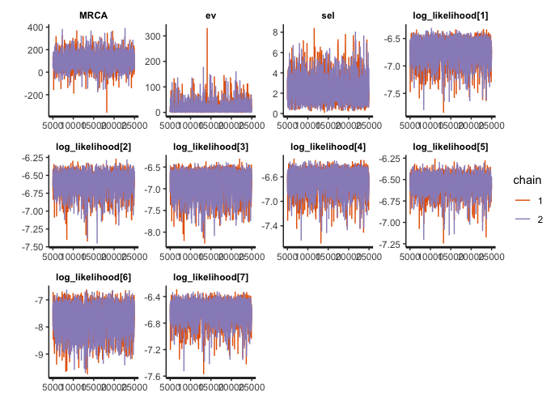

# "BSDSモデルによる方向性淘汰圧の推定"
author: "Ph.D. Ohkubo Yusaku (ROIS-DS & Institute of Statistical Mathematics) {y-ohkubo[--]ism.ac.jp}"<br>
date: "Mar.9 2021"


## Introduction
枝特異的方向性淘汰モデル(branch-specific directional selection; 以下、BSDS)は種間系統比較法(phylogenetic comparative method)の一種で、系統樹における一部の枝で方向性淘汰を経た生物の形質を分析するために開発されました。
このドキュメントでは、仮想の形質データを題材にRとStanで実際にBSDSモデルを使ってマクロ進化の分析を実行する方法について紹介します。
__なお、BSDSモデルをランダム効果として使った回帰モデル(BSDS-LMM)を実行するには以下のページを参照してください。__

https://github.com/OhkuboYusaku/PCM_BSDS/tree/main/example/BSDS_LMM

## 下準備
### 必要パッケージのインストール
このコードでは、{ape},{rstan}の2つのパッケージに依存しています。事前にインストールし、読み込んでおきます。

```r
install.packages(c("ape", "rstan"))
```


```r
library(ape)
library(rstan)
```

```
## Loading required package: StanHeaders
```

```
## Loading required package: ggplot2
```

```
## rstan (Version 2.21.2, GitRev: 2e1f913d3ca3)
```

```
## For execution on a local, multicore CPU with excess RAM we recommend calling
## options(mc.cores = parallel::detectCores()).
## To avoid recompilation of unchanged Stan programs, we recommend calling
## rstan_options(auto_write = TRUE)
```
Stanのインストールがうまくいかない場合は、下記の公式ドキュメントを参照してください。
https://github.com/stan-dev/rstan/wiki/RStan-Getting-Started-(Japanese)


### 必要な関数の定義
BSDSモデルをStanで実行するには、各個体の形質値、種名のインデックス、系統樹のトポロジーと枝長、など多くのデータを受け渡す必要があります。そこで、これらのデータを一括してStanに渡すリスト形式に変換できるようあらかじめ関数を定義しておくと便利です。

```r
# define data-arrangement function
BSDS2stan_data<- function(phylo, y, Z, D_edge){
  len_phylo<- length(phylo$edge.length)
  N_tip<- len_phylo - phylo$Nnode +1
  branch_len<- phylo$edge.length
  tree_obj<- as.matrix(phylo$edge)
  MRCA_ij<- matrix(0, N_tip, N_tip) ## i,j elements correspond to the location of their MRCA in the tree
  
  for(i in 1:N_tip){
    for(j in i:N_tip){
      MRCA_ij[i,j]<- MRCA_ij[j,i]<- getMRCA(phylo, tip=c(i,j))
    }
  }
  
  dat<- list(N=length(y), N_sp=N_tip, 
             len_phylo=len_phylo, branch_len=branch_len, tree_obj=tree_obj, MRCA_ij=MRCA_ij,
             y=y, Z=Z, D_edge=D_edge)
  
  return (dat)
}
```


## 実行例
### データの読み込み
まず、題材となるデータを読み込み、構造を確認します。


```r
data<- read.csv("BSDS_sample.csv")
summary(data)
```

```
##        X                Y              sp_ID     
##  Min.   :  1.00   Min.   :-735.9   Min.   : 1.0  
##  1st Qu.: 25.75   1st Qu.: -51.4   1st Qu.: 3.0  
##  Median : 50.50   Median : 108.4   Median : 5.5  
##  Mean   : 50.50   Mean   : 260.9   Mean   : 5.5  
##  3rd Qu.: 75.25   3rd Qu.: 355.5   3rd Qu.: 8.0  
##  Max.   :100.00   Max.   :2002.6   Max.   :10.0
```

```r
Y<- data$Y
sp_ID<- (data$sp_ID)
```

Yに各個体(i=1,2,...N_sample)の形質値、sp_IDに各個体の種ID(1,2,...N_sp)を格納しています。


次に系統樹を読み込みます。ここでは、{ape}パッケージの関数を用いてNewick形式で記録された系統樹を読み込みます。


```r
phylo<- read.tree("BSDS_tree")
plot(phylo)
axisPhylo()
```

<!-- -->

```r
phylo$edge # tree構造:[,1]の親種から[,2]の子孫種へエッジが伸びている
```

```
##       [,1] [,2]
##  [1,]   11   12
##  [2,]   12    1
##  [3,]   12   13
##  [4,]   13   14
##  [5,]   14    2
##  [6,]   14   15
##  [7,]   15    3
##  [8,]   15    4
##  [9,]   13   16
## [10,]   16    5
## [11,]   16    6
## [12,]   11   17
## [13,]   17   18
## [14,]   18    7
## [15,]   18   19
## [16,]   19    8
## [17,]   19    9
## [18,]   17   10
```

また、方向性淘汰が生じたと思われる箇所を指定します。例えば、「原生種t1が、t5との共通祖先(sp12)と分岐した直後から方向性淘汰を受けるようになった」と仮定します。この場合、phylo$edgeにおいて「sp12からsp1」に伸びる枝、すなわち[2,]が該当する箇所になります。


```r
D_edge<- 2
```


最後に、これらのデータを先の関数でリスト形式に変換します。


```r
dat<- BSDS2stan_data(phylo, Y, sp_ID, D_edge)
```

### Stanの設定
Stanコードのファイル名を渡し(scr)、MCMCのサンプリング(ite)とwarmup(war)の回数、マルコフ連鎖の本数(cha)を指定します。


parには、推定するパラメータを指定します(オプション）。

マルチコアCPUの場合、最後のオプションを有効にすることで並列計算を実行することができ時間の節約になります。

```r
scr<-"stan_BSDS.stan"
war<- 5000
ite<- 25000
cha<- 2
par<- c("MRCA", "ev", "sel", "log_likelihood")
options(mc.cores = parallel::detectCores())
```

### サンプリングの開始
いよいよ、MCMCで事後分布からのサンプリングを行います。

```r
fit_BSDS<- stan(file = scr, model_name = scr, data = dat, pars = par, chains = cha, 
          warmup = war, iter = ite, thin = 10)
```
サンプリングの実行後にDivergent transitionやmaximum treedepthの警告が表示される際には、下記を参考にadapt_deltaなどを調節します。
https://mc-stan.org/misc/warnings.html#divergent-transitions-after-warmup

## 結果の出力
## 結果の出力
__MCMCが収束していることを保証するため、必ずtraceplot()やR_hatを確認しましょう。__
print()関数で、R_hatも含めた要約統計量の一覧を得ることができます。

```r
print(fit_BSDS)
```

```
## Inference for Stan model: stan_BSDS.stan.
## 2 chains, each with iter=25000; warmup=5000; thin=10; 
## post-warmup draws per chain=2000, total post-warmup draws=4000.
## 
##                        mean se_mean    sd    2.5%     25%     50%     75%
## MRCA                  95.39    0.44 28.09   40.32   76.47   95.40  114.24
## ev                    94.15    0.21 13.76   70.10   84.42   93.15  102.90
## sel                    1.54    0.00  0.10    1.38    1.47    1.53    1.60
## log_likelihood[1]     -6.52    0.00  0.24   -7.12   -6.65   -6.47   -6.34
## log_likelihood[2]     -6.35    0.00  0.15   -6.74   -6.42   -6.32   -6.24
## log_likelihood[3]     -6.89    0.01  0.36   -7.70   -7.11   -6.84   -6.63
## log_likelihood[4]     -6.42    0.00  0.20   -6.93   -6.52   -6.38   -6.28
## log_likelihood[5]     -6.27    0.00  0.10   -6.52   -6.33   -6.26   -6.21
## log_likelihood[6]     -8.34    0.01  0.69   -9.77   -8.78   -8.29   -7.84
## log_likelihood[7]     -6.37    0.00  0.17   -6.80   -6.44   -6.33   -6.25
## log_likelihood[8]     -6.27    0.00  0.10   -6.50   -6.32   -6.26   -6.20
## log_likelihood[9]     -6.65    0.00  0.29   -7.36   -6.80   -6.60   -6.43
## log_likelihood[10]    -6.67    0.00  0.30   -7.39   -6.83   -6.62   -6.45
## log_likelihood[11]    -6.91    0.00  0.08   -7.07   -6.96   -6.90   -6.85
## log_likelihood[12]    -7.59    0.00  0.15   -7.92   -7.69   -7.59   -7.49
## log_likelihood[13]    -6.68    0.00  0.07   -6.82   -6.73   -6.68   -6.63
## log_likelihood[14]    -6.71    0.00  0.07   -6.85   -6.76   -6.71   -6.66
## log_likelihood[15]    -6.62    0.00  0.07   -6.76   -6.67   -6.62   -6.58
## log_likelihood[16]    -7.05    0.00  0.09   -7.24   -7.11   -7.05   -6.99
## log_likelihood[17]    -6.78    0.00  0.07   -6.92   -6.83   -6.78   -6.73
## log_likelihood[18]    -6.62    0.00  0.07   -6.76   -6.67   -6.62   -6.57
## log_likelihood[19]    -6.80    0.00  0.07   -6.94   -6.84   -6.79   -6.74
## log_likelihood[20]    -6.83    0.00  0.08   -6.98   -6.88   -6.83   -6.78
## log_likelihood[21]    -7.41    0.00  0.10   -7.62   -7.47   -7.40   -7.34
## log_likelihood[22]    -7.68    0.00  0.13   -7.96   -7.76   -7.67   -7.58
## log_likelihood[23]    -7.06    0.00  0.07   -7.20   -7.10   -7.06   -7.01
## log_likelihood[24]    -7.08    0.00  0.07   -7.22   -7.12   -7.08   -7.03
## log_likelihood[25]    -6.77    0.00  0.07   -6.91   -6.81   -6.77   -6.72
## log_likelihood[26]    -7.33    0.00  0.09   -7.52   -7.39   -7.32   -7.26
## log_likelihood[27]    -7.33    0.00  0.09   -7.53   -7.39   -7.33   -7.27
## log_likelihood[28]    -7.43    0.00  0.10   -7.64   -7.49   -7.42   -7.36
## log_likelihood[29]    -6.75    0.00  0.07   -6.89   -6.80   -6.75   -6.70
## log_likelihood[30]    -7.60    0.00  0.12   -7.86   -7.68   -7.59   -7.52
## log_likelihood[31]    -8.41    0.00  0.23   -8.91   -8.55   -8.39   -8.24
## log_likelihood[32]    -7.04    0.00  0.07   -7.19   -7.09   -7.04   -6.99
## log_likelihood[33]    -6.95    0.00  0.07   -7.09   -7.00   -6.95   -6.90
## log_likelihood[34]    -6.83    0.00  0.07   -6.97   -6.87   -6.83   -6.78
## log_likelihood[35]    -6.73    0.00  0.07   -6.87   -6.78   -6.73   -6.68
## log_likelihood[36]    -6.97    0.00  0.07   -7.11   -7.01   -6.97   -6.92
## log_likelihood[37]    -7.18    0.00  0.08   -7.34   -7.23   -7.18   -7.12
## log_likelihood[38]    -7.00    0.00  0.07   -7.14   -7.05   -7.00   -6.96
## log_likelihood[39]    -6.74    0.00  0.07   -6.88   -6.79   -6.74   -6.69
## log_likelihood[40]    -7.07    0.00  0.07   -7.21   -7.12   -7.07   -7.02
## log_likelihood[41]    -7.28    0.00  0.17   -7.64   -7.38   -7.27   -7.16
## log_likelihood[42]    -9.87    0.01  0.53  -11.00  -10.21   -9.83   -9.49
## log_likelihood[43]    -6.69    0.00  0.09   -6.88   -6.74   -6.68   -6.62
## log_likelihood[44]    -6.43    0.00  0.07   -6.58   -6.48   -6.43   -6.38
## log_likelihood[45]    -6.50    0.00  0.08   -6.66   -6.55   -6.49   -6.44
## log_likelihood[46]    -6.78    0.00  0.10   -6.99   -6.84   -6.77   -6.70
## log_likelihood[47]    -6.46    0.00  0.08   -6.61   -6.51   -6.46   -6.41
## log_likelihood[48]    -6.43    0.00  0.07   -6.57   -6.48   -6.43   -6.38
## log_likelihood[49]    -6.86    0.00  0.11   -7.09   -6.93   -6.85   -6.78
## log_likelihood[50]    -6.51    0.00  0.08   -6.68   -6.57   -6.51   -6.46
## log_likelihood[51]    -6.58    0.00  0.07   -6.73   -6.63   -6.58   -6.53
## log_likelihood[52]    -6.65    0.00  0.08   -6.80   -6.70   -6.65   -6.60
## log_likelihood[53]    -6.65    0.00  0.08   -6.80   -6.70   -6.65   -6.60
## log_likelihood[54]    -6.89    0.00  0.09   -7.08   -6.95   -6.89   -6.83
## log_likelihood[55]    -6.52    0.00  0.07   -6.66   -6.57   -6.52   -6.47
## log_likelihood[56]    -6.85    0.00  0.09   -7.03   -6.91   -6.85   -6.79
## log_likelihood[57]    -6.60    0.00  0.07   -6.75   -6.64   -6.60   -6.55
## log_likelihood[58]    -6.89    0.00  0.09   -7.08   -6.95   -6.89   -6.83
## log_likelihood[59]    -6.56    0.00  0.07   -6.70   -6.61   -6.56   -6.51
## log_likelihood[60]    -6.57    0.00  0.07   -6.71   -6.62   -6.57   -6.52
## log_likelihood[61]    -6.44    0.00  0.07   -6.58   -6.48   -6.43   -6.38
## log_likelihood[62]    -7.48    0.00  0.19   -7.90   -7.61   -7.47   -7.35
## log_likelihood[63]    -6.59    0.00  0.09   -6.77   -6.65   -6.59   -6.53
## log_likelihood[64]   -10.63    0.01  0.64  -12.06  -11.03  -10.59  -10.19
## log_likelihood[65]    -6.47    0.00  0.08   -6.63   -6.53   -6.47   -6.42
## log_likelihood[66]    -7.85    0.00  0.24   -8.39   -8.00   -7.83   -7.68
## log_likelihood[67]    -6.47    0.00  0.08   -6.62   -6.52   -6.47   -6.42
## log_likelihood[68]    -6.50    0.00  0.08   -6.66   -6.55   -6.50   -6.45
## log_likelihood[69]    -6.40    0.00  0.07   -6.54   -6.45   -6.40   -6.35
## log_likelihood[70]    -6.57    0.00  0.08   -6.74   -6.62   -6.57   -6.51
## log_likelihood[71]    -6.57    0.00  0.08   -6.74   -6.62   -6.57   -6.51
## log_likelihood[72]    -6.50    0.00  0.08   -6.65   -6.55   -6.50   -6.44
## log_likelihood[73]    -6.72    0.00  0.10   -6.92   -6.78   -6.72   -6.65
## log_likelihood[74]    -7.48    0.00  0.19   -7.89   -7.60   -7.47   -7.35
## log_likelihood[75]    -6.81    0.00  0.11   -7.03   -6.88   -6.81   -6.74
## log_likelihood[76]    -7.07    0.00  0.13   -7.35   -7.15   -7.06   -6.97
## log_likelihood[77]    -7.73    0.00  0.22   -8.22   -7.87   -7.71   -7.58
## log_likelihood[78]    -6.66    0.00  0.09   -6.85   -6.72   -6.66   -6.60
## log_likelihood[79]    -6.68    0.00  0.09   -6.87   -6.74   -6.67   -6.61
## log_likelihood[80]    -6.67    0.00  0.09   -6.86   -6.73   -6.66   -6.60
## log_likelihood[81]    -6.69    0.00  0.08   -6.84   -6.74   -6.69   -6.64
## log_likelihood[82]    -6.58    0.00  0.07   -6.72   -6.63   -6.58   -6.53
## log_likelihood[83]   -11.07    0.01  0.66  -12.46  -11.49  -11.03  -10.60
## log_likelihood[84]    -6.98    0.00  0.09   -7.18   -7.04   -6.98   -6.92
## log_likelihood[85]    -7.61    0.00  0.17   -7.97   -7.71   -7.60   -7.49
## log_likelihood[86]    -8.01    0.00  0.22   -8.50   -8.15   -7.99   -7.85
## log_likelihood[87]    -7.11    0.00  0.11   -7.33   -7.18   -7.10   -7.03
## log_likelihood[88]    -6.56    0.00  0.07   -6.70   -6.61   -6.56   -6.51
## log_likelihood[89]    -6.68    0.00  0.07   -6.82   -6.73   -6.68   -6.62
## log_likelihood[90]    -6.57    0.00  0.07   -6.71   -6.62   -6.57   -6.52
## log_likelihood[91]    -6.67    0.00  0.10   -6.88   -6.73   -6.67   -6.60
## log_likelihood[92]    -6.44    0.00  0.08   -6.60   -6.50   -6.44   -6.39
## log_likelihood[93]    -6.45    0.00  0.08   -6.60   -6.50   -6.45   -6.39
## log_likelihood[94]    -7.09    0.00  0.15   -7.40   -7.18   -7.08   -6.98
## log_likelihood[95]    -6.39    0.00  0.07   -6.53   -6.44   -6.39   -6.34
## log_likelihood[96]    -7.12    0.00  0.15   -7.44   -7.21   -7.10   -7.01
## log_likelihood[97]    -8.04    0.00  0.28   -8.64   -8.21   -8.02   -7.84
## log_likelihood[98]    -6.38    0.00  0.07   -6.53   -6.43   -6.38   -6.34
## log_likelihood[99]    -6.50    0.00  0.08   -6.67   -6.55   -6.50   -6.45
## log_likelihood[100]   -9.10    0.01  0.43  -10.05   -9.37   -9.07   -8.80
## lp__                -695.65    0.02  1.26 -698.98 -696.17 -695.33 -694.73
##                       97.5% n_eff Rhat
## MRCA                 149.89  4077    1
## ev                   123.44  4104    1
## sel                    1.75  4060    1
## log_likelihood[1]     -6.19  3920    1
## log_likelihood[2]     -6.14  3996    1
## log_likelihood[3]     -6.33  3879    1
## log_likelihood[4]     -6.16  3928    1
## log_likelihood[5]     -6.11  4097    1
## log_likelihood[6]     -7.17  3860    1
## log_likelihood[7]     -6.14  3943    1
## log_likelihood[8]     -6.11  4134    1
## log_likelihood[9]     -6.24  3919    1
## log_likelihood[10]    -6.25  3920    1
## log_likelihood[11]    -6.75  4032    1
## log_likelihood[12]    -7.33  4025    1
## log_likelihood[13]    -6.54  4004    1
## log_likelihood[14]    -6.57  3995    1
## log_likelihood[15]    -6.48  4122    1
## log_likelihood[16]    -6.89  4118    1
## log_likelihood[17]    -6.64  3996    1
## log_likelihood[18]    -6.47  4054    1
## log_likelihood[19]    -6.65  3999    1
## log_likelihood[20]    -6.69  4007    1
## log_likelihood[21]    -7.23  4061    1
## log_likelihood[22]    -7.45  4024    1
## log_likelihood[23]    -6.92  4170    1
## log_likelihood[24]    -6.94  4164    1
## log_likelihood[25]    -6.63  4130    1
## log_likelihood[26]    -7.16  4079    1
## log_likelihood[27]    -7.17  4133    1
## log_likelihood[28]    -7.25  4157    1
## log_likelihood[29]    -6.61  4099    1
## log_likelihood[30]    -7.39  4185    1
## log_likelihood[31]    -8.01  4007    1
## log_likelihood[32]    -6.91  4169    1
## log_likelihood[33]    -6.81  4190    1
## log_likelihood[34]    -6.69  4179    1
## log_likelihood[35]    -6.59  4079    1
## log_likelihood[36]    -6.83  4187    1
## log_likelihood[37]    -7.03  4083    1
## log_likelihood[38]    -6.87  4016    1
## log_likelihood[39]    -6.59  4104    1
## log_likelihood[40]    -6.93  4039    1
## log_likelihood[41]    -6.98  4042    1
## log_likelihood[42]    -8.95  4011    1
## log_likelihood[43]    -6.51  4149    1
## log_likelihood[44]    -6.29  4136    1
## log_likelihood[45]    -6.34  4169    1
## log_likelihood[46]    -6.59  4126    1
## log_likelihood[47]    -6.31  4154    1
## log_likelihood[48]    -6.28  4130    1
## log_likelihood[49]    -6.65  4098    1
## log_likelihood[50]    -6.36  3990    1
## log_likelihood[51]    -6.43  4163    1
## log_likelihood[52]    -6.50  4181    1
## log_likelihood[53]    -6.50  4181    1
## log_likelihood[54]    -6.72  4134    1
## log_likelihood[55]    -6.38  4059    1
## log_likelihood[56]    -6.69  4145    1
## log_likelihood[57]    -6.45  4170    1
## log_likelihood[58]    -6.72  4065    1
## log_likelihood[59]    -6.42  4010    1
## log_likelihood[60]    -6.43  4004    1
## log_likelihood[61]    -6.29  4140    1
## log_likelihood[62]    -7.14  4028    1
## log_likelihood[63]    -6.43  4168    1
## log_likelihood[64]    -9.52  4197    1
## log_likelihood[65]    -6.33  3990    1
## log_likelihood[66]    -7.42  4207    1
## log_likelihood[67]    -6.32  4161    1
## log_likelihood[68]    -6.35  4170    1
## log_likelihood[69]    -6.26  4068    1
## log_likelihood[70]    -6.41  4002    1
## log_likelihood[71]    -6.42  3998    1
## log_likelihood[72]    -6.35  3990    1
## log_likelihood[73]    -6.54  4144    1
## log_likelihood[74]    -7.15  4192    1
## log_likelihood[75]    -6.62  4121    1
## log_likelihood[76]    -6.83  4145    1
## log_likelihood[77]    -7.34  4204    1
## log_likelihood[78]    -6.50  4028    1
## log_likelihood[79]    -6.51  4033    1
## log_likelihood[80]    -6.50  4029    1
## log_likelihood[81]    -6.55  4183    1
## log_likelihood[82]    -6.44  4139    1
## log_likelihood[83]    -9.92  4022    1
## log_likelihood[84]    -6.80  4085    1
## log_likelihood[85]    -7.31  4023    1
## log_likelihood[86]    -7.62  4208    1
## log_likelihood[87]    -6.91  4125    1
## log_likelihood[88]    -6.42  4118    1
## log_likelihood[89]    -6.53  3993    1
## log_likelihood[90]    -6.43  4130    1
## log_likelihood[91]    -6.49  4142    1
## log_likelihood[92]    -6.30  3989    1
## log_likelihood[93]    -6.30  3988    1
## log_likelihood[94]    -6.83  4155    1
## log_likelihood[95]    -6.24  4116    1
## log_likelihood[96]    -6.85  4159    1
## log_likelihood[97]    -7.54  4011    1
## log_likelihood[98]    -6.24  4110    1
## log_likelihood[99]    -6.34  4171    1
## log_likelihood[100]   -8.34  4209    1
## lp__                -694.24  4016    1
## 
## Samples were drawn using NUTS(diag_e) at Tue Mar  9 17:32:32 2021.
## For each parameter, n_eff is a crude measure of effective sample size,
## and Rhat is the potential scale reduction factor on split chains (at 
## convergence, Rhat=1).
```


```r
traceplot(fit_BSDS)
```

```
## 'pars' not specified. Showing first 10 parameters by default.
```

<!-- -->

その他{shinystan}では、マルコフ連鎖の診断や事後分布の可視化など優れたツールを提供しています。

### WAICの計算

```r
install.packages(loo)
library(loo)
waic(extract(fit_BSDS)$log_likelihood)
```

### 周辺尤度の計算

今回使用しているstanコードでは、すべてのパラメータに対してtarget+記法を採用しています。したがって、lp__変数を手元のモンテカルロ標本で平均すると周辺尤度の近似値が得られることになります(調和平均法)。ただし一般に調和平均による周辺尤度の計算は揺らぎが大きいことが知られており、実務的にはRパッケージ{bridgesampling}などを用いて再計算することをお勧めします。__周辺尤度を計算する際には元のstanコードを改変し、事前分布の正則性が保証されていることを必ず確認してください。__

### なんらかの理由でベイズ推定を絶対に使いたくない場合や、p値が算出できない統計手法は絶対に採用したくない場合

ニュートン法などで最尤推定値を求めたり、2次までの近似に基づくWald検定を行うことができます。ただしサンプルサイズが大きくない場合には、最尤推定量に3次より高い項が残りWald検定の要求する仮定(最尤推定値が真の値の周りで正規分布に従う)を満たさない傾向にあるようです(数値実験; Ohkubo unpubl.)。この場合は標準誤差の見積もりがやや楽観的になり、p値=5%水準で検定を行っても第一種の過誤を犯す確率が5%に収まりません。高次の補正項が理論的にわかるまでは、十分な注意が必要です。


## References
大久保, 沓掛, 小泉 (2021)."枝特異的な方向性淘汰の推定について", March 17. 第68日本生態学会全国大会(https://esj.ne.jp/meeting/abst/68/D01-12.html)  
Ohkubo, Kutsukake, Koizumi (under review) "Evaluating a strength of directional selection using a novel branch-specific directional selection (BSDS) model of phylogenetic comparative method"
