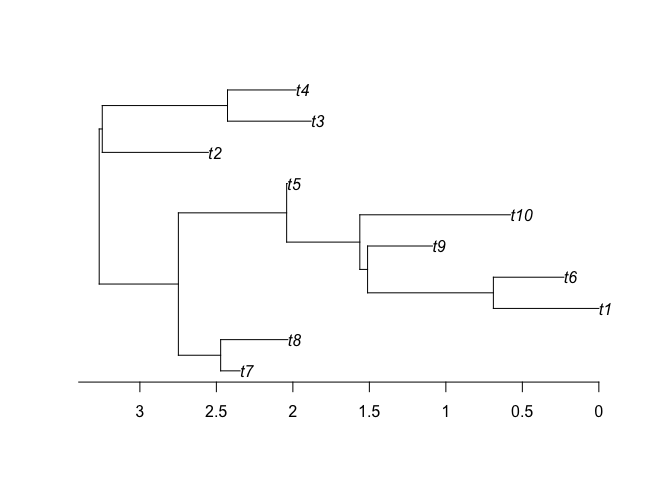
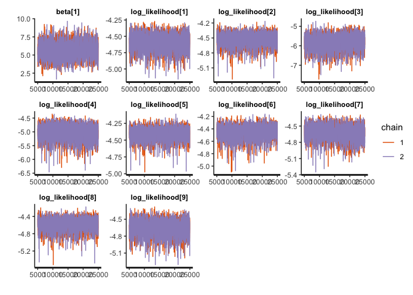

# "BSDSモデルによる線形変量効果モデル(BSDS-LMM)の推定"
author: "Ph.D. Ohkubo Yusaku (ROIS-DS & Institute of Statistical Mathematics) {y-ohkubo[--]ism.ac.jp}"<br>
date: "Mar.9 2021"


## Introduction
枝特異的方向性淘汰モデル(branch-specific directional selection; 以下、BSDS)は種間系統比較法(phylogenetic comparative method)の一種で、系統樹における一部の枝で方向性淘汰を経た生物の形質を分析するために開発されました。
このドキュメントでは、仮想の形質データを題材にRとStanで実際にBSDSモデルを使った回帰分析を実行する方法について紹介します。


__なお回帰ではなく(説明変数がない）、祖先形質(MRCA)、進化率(ev)、選択圧の強さ(k)などマクロ進化に関わるパラメータそのものを推定したい場合は、以下のページを参照してください。__

https://github.com/OhkuboYusaku/PCM_BSDS/tree/main/example/BSDS

## 下準備
### 必要パッケージのインストール
以下のコードでは、{ape},{rstan}{dummies}の3つのパッケージに依存しています。事前にインストールし、読み込んでおきます。

```r
install.packages(c("ape", "rstan", "dummies"))
```


```r
library(ape)
library(rstan)
```

```
## Loading required package: StanHeaders
```

```
## Loading required package: ggplot2
```

```
## rstan (Version 2.21.2, GitRev: 2e1f913d3ca3)
```

```
## For execution on a local, multicore CPU with excess RAM we recommend calling
## options(mc.cores = parallel::detectCores()).
## To avoid recompilation of unchanged Stan programs, we recommend calling
## rstan_options(auto_write = TRUE)
```

```r
library(dummies)
```

```
## dummies-1.5.6 provided by Decision Patterns
```


Stanのインストールがうまくいかない場合は、下記の公式ドキュメントを参照してください。
https://github.com/stan-dev/rstan/wiki/RStan-Getting-Started-(Japanese)


### 必要な関数の準備
BSDSモデルをStanで実行するには、各個体の形質値、説明変数、種名のインデックス、系統樹のトポロジーと枝長、など多くのデータを受け渡す必要があります。そこで、これらのデータを一括してStanに渡すリスト形式に変換できるようあらかじめ関数を定義しておくと便利です。

```r
# define data-arrangement function
BSDSLMM_data<- function(phylo, y, X, Z, D_edge){
  len_phylo<- length(phylo$edge.length)
  N_tip<- len_phylo - phylo$Nnode +1
  branch_len<- phylo$edge.length
  tree_obj<- as.matrix(phylo$edge)
  MRCA_ij<- matrix(0, N_tip, N_tip) ## i,j elements correspond to the location of their MRCA in the tree
  
  for(i in 1:N_tip){
    for(j in i:N_tip){
      MRCA_ij[i,j]<- MRCA_ij[j,i]<- getMRCA(phylo, tip=c(i,j))
    }
  }
  
  dat<- list(N=length(y), N_sp=N_tip, 
             len_phylo=len_phylo, branch_len=branch_len, tree_obj=tree_obj, MRCA_ij=MRCA_ij,
             y=y, X=X, Z=dummy(Z), D_edge=D_edge, D=ncol(X))
  
  return (dat)
}
```


## 実行例
### データの読み込み
まず、題材となるデータを読み込み、構造を確認します。


```r
data<- read.csv("BSDS_LMM_sample.csv")
summary(data)
```

```
##        Y                X               sp_ID     
##  Min.   : 20.56   Min.   :-4.8131   Min.   : 1.0  
##  1st Qu.: 86.58   1st Qu.:-2.2647   1st Qu.: 3.0  
##  Median :106.86   Median : 0.6529   Median : 5.5  
##  Mean   :109.92   Mean   : 0.3112   Mean   : 5.5  
##  3rd Qu.:131.81   3rd Qu.: 3.0415   3rd Qu.: 8.0  
##  Max.   :192.75   Max.   : 4.9214   Max.   :10.0
```

```r
Y<- data$Y
X<- as.matrix(data$X)
sp_ID<- (data$sp_ID)
```

Yに各個体(i=1,2,...N_sample)の形質値、Xに説明変数(今回は1次元)、sp_IDに各個体の種ID(1,2,...N_sp)を格納しています。


次に系統樹を読み込みます。ここでは、{ape}パッケージの関数を用いてNewick形式で記録された系統樹を読み込みます。

```r
phylo<- read.tree("BSDS_LMM_tree")
plot(phylo)
axisPhylo()
```

<!-- -->

```r
phylo$edge # tree構造:[,1]の親種から[,2]の子孫種へエッジが伸びている
```

```
##       [,1] [,2]
##  [1,]   11   12
##  [2,]   12   13
##  [3,]   13    1
##  [4,]   13    2
##  [5,]   12   14
##  [6,]   14   15
##  [7,]   15   16
##  [8,]   16   17
##  [9,]   17    3
## [10,]   17    4
## [11,]   16    5
## [12,]   15    6
## [13,]   14    7
## [14,]   11   18
## [15,]   18    8
## [16,]   18   19
## [17,]   19    9
## [18,]   19   10
```

また、方向性淘汰が生じたと思われる箇所を指定します。例えば、「原生種t10が、t1, t6, t9の共通祖先(sp19)と分岐した直後から方向性淘汰を受けるようになった」と仮定します。この場合、phylo$edgeにおいて「sp19からsp10」に伸びる枝、すなわちphylo$eddgeの[18,]が該当する箇所になります。


```r
D_edge<- 18
```

複数の枝で方向性淘汰が生じている場合にもc(10, 18)などで渡すことができますが、下記で読み込むStanモデルのソースコードに若干の修正を要します。


最後に、これらのデータを先の関数でリスト形式に変換します。


```r
dat<- BSDSLMM_data(phylo, Y, X, sp_ID, D_edge)
```

```
## Warning in model.matrix.default(~x - 1, model.frame(~x - 1), contrasts = FALSE):
## non-list contrasts argument ignored
```

警告が出ますが、無視して構いません。

### Stanの設定
Stanコードのファイル名を渡し(scr)、MCMCのサンプリング(ite)とwarmup(war)の回数、マルコフ連鎖の本数(cha)を指定します。


parには、推定するパラメータを指定します(オプション）。
説明変数の回帰係数を知りたいだけならbetaだけでも良いですが、WAICなどを計算するにはlog_likelihoodも必要になります。
__なお祖先種の状態(MRCA),進化率(ev),淘汰圧の強さ(k)を指定することもできますが、混合効果モデル(LMM)では~~識別性(identifiability)の問題が生じる　~~ (3/18)パラメタ間に非常に強い相関が生じるようです。したがって、ランダム効果に関わるパラメータは周辺化してしまうことをお勧めします。__

マルチコアCPUの場合、最後のオプションを有効にすることで並列計算を実行することができ時間の節約になります。

```r
scr<-"stan_BSDS_LMM.stan"
war<- 5000
ite<- 25000
cha<- 2
par<- c("beta", "log_likelihood")
options(mc.cores = parallel::detectCores())
```

### サンプリングの開始
いよいよ、MCMCで事後分布からのサンプリングを行います。

```r
fit_BSDS<- stan(file = scr, model_name = scr, data = dat, pars = par, chains = cha, 
          warmup = war, iter = ite, thin = 10, control = list(adapt_delta=0.95))
```

```
## Trying to compile a simple C file
```

```
## Running /Library/Frameworks/R.framework/Resources/bin/R CMD SHLIB foo.c
## clang -mmacosx-version-min=10.13 -I"/Library/Frameworks/R.framework/Resources/include" -DNDEBUG   -I"/Library/Frameworks/R.framework/Versions/4.0/Resources/library/Rcpp/include/"  -I"/Library/Frameworks/R.framework/Versions/4.0/Resources/library/RcppEigen/include/"  -I"/Library/Frameworks/R.framework/Versions/4.0/Resources/library/RcppEigen/include/unsupported"  -I"/Library/Frameworks/R.framework/Versions/4.0/Resources/library/BH/include" -I"/Library/Frameworks/R.framework/Versions/4.0/Resources/library/StanHeaders/include/src/"  -I"/Library/Frameworks/R.framework/Versions/4.0/Resources/library/StanHeaders/include/"  -I"/Library/Frameworks/R.framework/Versions/4.0/Resources/library/RcppParallel/include/"  -I"/Library/Frameworks/R.framework/Versions/4.0/Resources/library/rstan/include" -DEIGEN_NO_DEBUG  -DBOOST_DISABLE_ASSERTS  -DBOOST_PENDING_INTEGER_LOG2_HPP  -DSTAN_THREADS  -DBOOST_NO_AUTO_PTR  -include '/Library/Frameworks/R.framework/Versions/4.0/Resources/library/StanHeaders/include/stan/math/prim/mat/fun/Eigen.hpp'  -D_REENTRANT -DRCPP_PARALLEL_USE_TBB=1   -I/usr/local/include   -fPIC  -Wall -g -O2  -c foo.c -o foo.o
## In file included from <built-in>:1:
## In file included from /Library/Frameworks/R.framework/Versions/4.0/Resources/library/StanHeaders/include/stan/math/prim/mat/fun/Eigen.hpp:13:
## In file included from /Library/Frameworks/R.framework/Versions/4.0/Resources/library/RcppEigen/include/Eigen/Dense:1:
## In file included from /Library/Frameworks/R.framework/Versions/4.0/Resources/library/RcppEigen/include/Eigen/Core:88:
## /Library/Frameworks/R.framework/Versions/4.0/Resources/library/RcppEigen/include/Eigen/src/Core/util/Macros.h:628:1: error: unknown type name 'namespace'
## namespace Eigen {
## ^
## /Library/Frameworks/R.framework/Versions/4.0/Resources/library/RcppEigen/include/Eigen/src/Core/util/Macros.h:628:16: error: expected ';' after top level declarator
## namespace Eigen {
##                ^
##                ;
## In file included from <built-in>:1:
## In file included from /Library/Frameworks/R.framework/Versions/4.0/Resources/library/StanHeaders/include/stan/math/prim/mat/fun/Eigen.hpp:13:
## In file included from /Library/Frameworks/R.framework/Versions/4.0/Resources/library/RcppEigen/include/Eigen/Dense:1:
## /Library/Frameworks/R.framework/Versions/4.0/Resources/library/RcppEigen/include/Eigen/Core:96:10: fatal error: 'complex' file not found
## #include <complex>
##          ^~~~~~~~~
## 3 errors generated.
## make: *** [foo.o] Error 1
```
サンプリングの実行後にDivergent transitionやmaximum treedepthの警告が表示される際には、下記を参考にadapt_deltaなどを調節します。
https://mc-stan.org/misc/warnings.html#divergent-transitions-after-warmup

## 結果の出力
__MCMCが収束していることを保証するため、必ずtraceplot()やR_hatを確認しましょう。__
print()関数で、R_hatも含めた要約統計量の一覧を得ることができます。

```r
print(fit_BSDS)
```

```
## Inference for Stan model: stan_BSDS_LMM.stan.
## 2 chains, each with iter=25000; warmup=5000; thin=10; 
## post-warmup draws per chain=2000, total post-warmup draws=4000.
## 
##                        mean se_mean   sd    2.5%     25%     50%     75%
## beta[1]                5.68    0.02 1.12    3.50    4.93    5.68    6.41
## log_likelihood[1]     -4.59    0.00 0.13   -4.87   -4.67   -4.58   -4.50
## log_likelihood[2]     -4.52    0.00 0.12   -4.80   -4.59   -4.51   -4.44
## log_likelihood[3]     -5.80    0.01 0.38   -6.65   -6.03   -5.75   -5.53
## log_likelihood[4]     -5.04    0.00 0.27   -5.62   -5.20   -5.02   -4.86
## log_likelihood[5]     -4.41    0.00 0.09   -4.60   -4.46   -4.40   -4.35
## log_likelihood[6]     -4.45    0.00 0.10   -4.68   -4.50   -4.44   -4.38
## log_likelihood[7]     -4.62    0.00 0.14   -4.92   -4.70   -4.62   -4.53
## log_likelihood[8]     -4.57    0.00 0.14   -4.90   -4.65   -4.55   -4.47
## log_likelihood[9]     -4.66    0.00 0.14   -4.97   -4.75   -4.65   -4.56
## log_likelihood[10]    -4.43    0.00 0.09   -4.62   -4.49   -4.42   -4.37
## log_likelihood[11]    -4.91    0.00 0.23   -5.42   -5.05   -4.89   -4.74
## log_likelihood[12]    -4.51    0.00 0.11   -4.75   -4.59   -4.51   -4.43
## log_likelihood[13]    -5.29    0.00 0.28   -5.97   -5.44   -5.25   -5.10
## log_likelihood[14]    -5.60    0.00 0.31   -6.25   -5.79   -5.60   -5.40
## log_likelihood[15]    -4.39    0.00 0.08   -4.55   -4.45   -4.39   -4.34
## log_likelihood[16]    -4.94    0.00 0.22   -5.48   -5.06   -4.91   -4.79
## log_likelihood[17]    -4.39    0.00 0.08   -4.56   -4.44   -4.39   -4.34
## log_likelihood[18]    -4.39    0.00 0.08   -4.55   -4.44   -4.39   -4.34
## log_likelihood[19]    -5.01    0.00 0.26   -5.58   -5.17   -5.00   -4.83
## log_likelihood[20]    -4.40    0.00 0.08   -4.57   -4.45   -4.40   -4.34
## log_likelihood[21]    -4.76    0.00 0.21   -5.27   -4.87   -4.72   -4.61
## log_likelihood[22]    -4.94    0.00 0.21   -5.39   -5.07   -4.93   -4.79
## log_likelihood[23]    -4.83    0.00 0.21   -5.30   -4.96   -4.82   -4.69
## log_likelihood[24]    -4.46    0.00 0.11   -4.71   -4.52   -4.45   -4.38
## log_likelihood[25]    -4.68    0.00 0.18   -5.07   -4.79   -4.67   -4.55
## log_likelihood[26]    -5.63    0.01 0.36   -6.39   -5.85   -5.61   -5.37
## log_likelihood[27]    -4.61    0.00 0.16   -4.96   -4.71   -4.59   -4.50
## log_likelihood[28]    -4.78    0.00 0.19   -5.23   -4.89   -4.76   -4.65
## log_likelihood[29]    -6.98    0.01 0.59   -8.30   -7.33   -6.91   -6.56
## log_likelihood[30]    -4.40    0.00 0.09   -4.58   -4.46   -4.40   -4.34
## log_likelihood[31]    -4.41    0.00 0.09   -4.61   -4.46   -4.40   -4.35
## log_likelihood[32]    -4.39    0.00 0.08   -4.56   -4.44   -4.39   -4.34
## log_likelihood[33]    -6.18    0.01 0.44   -7.05   -6.47   -6.15   -5.88
## log_likelihood[34]    -4.56    0.00 0.16   -4.95   -4.64   -4.54   -4.45
## log_likelihood[35]    -5.80    0.01 0.37   -6.55   -6.03   -5.79   -5.54
## log_likelihood[36]    -6.07    0.01 0.41   -6.88   -6.34   -6.04   -5.79
## log_likelihood[37]    -4.40    0.00 0.09   -4.59   -4.46   -4.40   -4.35
## log_likelihood[38]    -4.95    0.00 0.23   -5.51   -5.07   -4.92   -4.79
## log_likelihood[39]    -7.10    0.01 0.67   -8.65   -7.48   -7.02   -6.63
## log_likelihood[40]    -4.64    0.00 0.14   -4.93   -4.74   -4.63   -4.54
## log_likelihood[41]    -4.98    0.00 0.22   -5.49   -5.10   -4.95   -4.82
## log_likelihood[42]    -4.41    0.00 0.09   -4.59   -4.46   -4.40   -4.35
## log_likelihood[43]    -4.61    0.00 0.15   -4.94   -4.69   -4.59   -4.50
## log_likelihood[44]    -4.50    0.00 0.11   -4.73   -4.56   -4.49   -4.42
## log_likelihood[45]    -4.47    0.00 0.11   -4.72   -4.53   -4.45   -4.39
## log_likelihood[46]    -5.32    0.00 0.25   -5.86   -5.48   -5.31   -5.15
## log_likelihood[47]    -4.41    0.00 0.09   -4.58   -4.46   -4.40   -4.35
## log_likelihood[48]    -4.43    0.00 0.09   -4.62   -4.48   -4.42   -4.37
## log_likelihood[49]    -5.43    0.01 0.33   -6.18   -5.62   -5.39   -5.21
## log_likelihood[50]    -4.50    0.00 0.11   -4.73   -4.56   -4.49   -4.42
## log_likelihood[51]    -5.37    0.01 0.31   -6.12   -5.53   -5.32   -5.15
## log_likelihood[52]    -5.88    0.01 0.44   -6.82   -6.15   -5.85   -5.57
## log_likelihood[53]    -6.01    0.01 0.44   -6.93   -6.28   -5.99   -5.70
## log_likelihood[54]    -6.91    0.01 0.57   -8.25   -7.25   -6.85   -6.51
## log_likelihood[55]    -4.87    0.00 0.22   -5.33   -5.01   -4.86   -4.71
## log_likelihood[56]    -5.38    0.01 0.35   -6.14   -5.59   -5.35   -5.13
## log_likelihood[57]    -4.44    0.00 0.11   -4.71   -4.50   -4.43   -4.37
## log_likelihood[58]    -4.78    0.00 0.22   -5.27   -4.91   -4.76   -4.62
## log_likelihood[59]    -5.87    0.01 0.46   -6.91   -6.15   -5.82   -5.55
## log_likelihood[60]    -4.87    0.00 0.24   -5.38   -5.02   -4.86   -4.70
## log_likelihood[61]    -4.79    0.00 0.15   -5.13   -4.87   -4.77   -4.68
## log_likelihood[62]    -4.38    0.00 0.08   -4.54   -4.44   -4.38   -4.33
## log_likelihood[63]    -5.26    0.00 0.26   -5.82   -5.41   -5.24   -5.07
## log_likelihood[64]    -5.24    0.00 0.21   -5.71   -5.36   -5.22   -5.10
## log_likelihood[65]    -4.39    0.00 0.08   -4.54   -4.44   -4.39   -4.33
## log_likelihood[66]    -5.40    0.00 0.29   -6.04   -5.58   -5.38   -5.20
## log_likelihood[67]    -4.39    0.00 0.08   -4.55   -4.44   -4.39   -4.34
## log_likelihood[68]    -4.78    0.00 0.15   -5.10   -4.87   -4.77   -4.67
## log_likelihood[69]    -5.03    0.00 0.18   -5.44   -5.14   -5.02   -4.91
## log_likelihood[70]    -4.50    0.00 0.12   -4.80   -4.57   -4.48   -4.41
## log_likelihood[71]    -4.55    0.00 0.16   -4.93   -4.65   -4.53   -4.44
## log_likelihood[72]    -4.39    0.00 0.08   -4.55   -4.45   -4.39   -4.34
## log_likelihood[73]    -4.59    0.00 0.14   -4.90   -4.69   -4.59   -4.49
## log_likelihood[74]    -4.83    0.00 0.24   -5.35   -4.98   -4.81   -4.66
## log_likelihood[75]    -4.47    0.00 0.11   -4.73   -4.53   -4.46   -4.39
## log_likelihood[76]    -4.39    0.00 0.08   -4.56   -4.45   -4.39   -4.34
## log_likelihood[77]    -4.46    0.00 0.11   -4.73   -4.51   -4.44   -4.38
## log_likelihood[78]    -4.52    0.00 0.12   -4.77   -4.59   -4.51   -4.43
## log_likelihood[79]    -4.46    0.00 0.12   -4.75   -4.52   -4.44   -4.38
## log_likelihood[80]    -4.66    0.00 0.19   -5.10   -4.77   -4.64   -4.52
## log_likelihood[81]    -4.58    0.00 0.14   -4.90   -4.66   -4.57   -4.48
## log_likelihood[82]    -4.81    0.00 0.20   -5.26   -4.92   -4.79   -4.68
## log_likelihood[83]    -4.40    0.00 0.09   -4.59   -4.46   -4.40   -4.34
## log_likelihood[84]    -4.47    0.00 0.12   -4.73   -4.53   -4.45   -4.39
## log_likelihood[85]    -4.99    0.00 0.26   -5.57   -5.13   -4.96   -4.81
## log_likelihood[86]    -4.49    0.00 0.11   -4.75   -4.55   -4.47   -4.41
## log_likelihood[87]    -4.63    0.00 0.16   -5.00   -4.72   -4.62   -4.53
## log_likelihood[88]    -5.65    0.01 0.38   -6.47   -5.88   -5.62   -5.38
## log_likelihood[89]    -4.41    0.00 0.09   -4.62   -4.46   -4.40   -4.35
## log_likelihood[90]    -4.49    0.00 0.13   -4.80   -4.56   -4.47   -4.40
## log_likelihood[91]    -5.29    0.01 0.41   -6.18   -5.53   -5.26   -4.99
## log_likelihood[92]    -4.58    0.00 0.19   -5.04   -4.66   -4.54   -4.45
## log_likelihood[93]    -4.43    0.00 0.11   -4.69   -4.48   -4.41   -4.36
## log_likelihood[94]    -4.56    0.00 0.18   -5.01   -4.64   -4.53   -4.44
## log_likelihood[95]    -5.21    0.01 0.35   -5.95   -5.42   -5.18   -4.97
## log_likelihood[96]    -4.83    0.00 0.27   -5.47   -4.96   -4.78   -4.64
## log_likelihood[97]    -4.41    0.00 0.09   -4.62   -4.47   -4.41   -4.35
## log_likelihood[98]    -4.44    0.00 0.12   -4.76   -4.49   -4.42   -4.36
## log_likelihood[99]    -4.59    0.00 0.18   -5.01   -4.68   -4.56   -4.46
## log_likelihood[100]   -4.44    0.00 0.12   -4.72   -4.49   -4.42   -4.36
## lp__                -510.61    0.10 5.01 -520.08 -513.83 -510.83 -507.65
##                       97.5% n_eff Rhat
## beta[1]                7.93  3611    1
## log_likelihood[1]     -4.37  3873    1
## log_likelihood[2]     -4.32  3759    1
## log_likelihood[3]     -5.17  3978    1
## log_likelihood[4]     -4.59  4098    1
## log_likelihood[5]     -4.25  3835    1
## log_likelihood[6]     -4.27  3977    1
## log_likelihood[7]     -4.39  4021    1
## log_likelihood[8]     -4.35  3691    1
## log_likelihood[9]     -4.40  3856    1
## log_likelihood[10]    -4.26  3978    1
## log_likelihood[11]    -4.50  3627    1
## log_likelihood[12]    -4.32  3963    1
## log_likelihood[13]    -4.87  3794    1
## log_likelihood[14]    -5.02  3952    1
## log_likelihood[15]    -4.24  3875    1
## log_likelihood[16]    -4.60  3759    1
## log_likelihood[17]    -4.24  3874    1
## log_likelihood[18]    -4.24  3863    1
## log_likelihood[19]    -4.55  3592    1
## log_likelihood[20]    -4.24  3917    1
## log_likelihood[21]    -4.44  3673    1
## log_likelihood[22]    -4.55  3782    1
## log_likelihood[23]    -4.47  3759    1
## log_likelihood[24]    -4.28  4092    1
## log_likelihood[25]    -4.38  3689    1
## log_likelihood[26]    -4.98  3909    1
## log_likelihood[27]    -4.35  3450    1
## log_likelihood[28]    -4.49  3782    1
## log_likelihood[29]    -6.02  3599    1
## log_likelihood[30]    -4.25  4001    1
## log_likelihood[31]    -4.25  3850    1
## log_likelihood[32]    -4.24  3836    1
## log_likelihood[33]    -5.37  3208    1
## log_likelihood[34]    -4.34  3397    1
## log_likelihood[35]    -5.12  3211    1
## log_likelihood[36]    -5.31  3165    1
## log_likelihood[37]    -4.25  3648    1
## log_likelihood[38]    -4.62  3348    1
## log_likelihood[39]    -6.02  3716    1
## log_likelihood[40]    -4.38  3506    1
## log_likelihood[41]    -4.61  3647    1
## log_likelihood[42]    -4.24  3933    1
## log_likelihood[43]    -4.35  3757    1
## log_likelihood[44]    -4.32  3721    1
## log_likelihood[45]    -4.28  3881    1
## log_likelihood[46]    -4.86  3703    1
## log_likelihood[47]    -4.25  4023    1
## log_likelihood[48]    -4.26  3931    1
## log_likelihood[49]    -4.89  3860    1
## log_likelihood[50]    -4.30  3902    1
## log_likelihood[51]    -4.90  3560    1
## log_likelihood[52]    -5.09  3581    1
## log_likelihood[53]    -5.20  3604    1
## log_likelihood[54]    -5.99  3614    1
## log_likelihood[55]    -4.48  3537    1
## log_likelihood[56]    -4.77  3602    1
## log_likelihood[57]    -4.27  4019    1
## log_likelihood[58]    -4.42  3703    1
## log_likelihood[59]    -5.11  3675    1
## log_likelihood[60]    -4.46  3501    1
## log_likelihood[61]    -4.52  4069    1
## log_likelihood[62]    -4.24  3993    1
## log_likelihood[63]    -4.81  4128    1
## log_likelihood[64]    -4.88  3966    1
## log_likelihood[65]    -4.24  3782    1
## log_likelihood[66]    -4.90  4155    1
## log_likelihood[67]    -4.24  3939    1
## log_likelihood[68]    -4.51  4070    1
## log_likelihood[69]    -4.71  4011    1
## log_likelihood[70]    -4.30  3666    1
## log_likelihood[71]    -4.30  3723    1
## log_likelihood[72]    -4.24  3888    1
## log_likelihood[73]    -4.35  3737    1
## log_likelihood[74]    -4.44  3844    1
## log_likelihood[75]    -4.28  3714    1
## log_likelihood[76]    -4.24  3933    1
## log_likelihood[77]    -4.28  3718    1
## log_likelihood[78]    -4.31  3753    1
## log_likelihood[79]    -4.28  3966    1
## log_likelihood[80]    -4.35  3831    1
## log_likelihood[81]    -4.36  3893    1
## log_likelihood[82]    -4.49  3865    1
## log_likelihood[83]    -4.24  3932    1
## log_likelihood[84]    -4.28  3970    1
## log_likelihood[85]    -4.57  3779    1
## log_likelihood[86]    -4.30  3859    1
## log_likelihood[87]    -4.38  3805    1
## log_likelihood[88]    -5.00  3890    1
## log_likelihood[89]    -4.25  3698    1
## log_likelihood[90]    -4.29  3776    1
## log_likelihood[91]    -4.60  3472    1
## log_likelihood[92]    -4.33  3558    1
## log_likelihood[93]    -4.25  3577    1
## log_likelihood[94]    -4.32  3509    1
## log_likelihood[95]    -4.61  3541    1
## log_likelihood[96]    -4.45  3550    1
## log_likelihood[97]    -4.25  3769    1
## log_likelihood[98]    -4.25  3940    1
## log_likelihood[99]    -4.32  3478    1
## log_likelihood[100]   -4.25  3531    1
## lp__                -499.77  2516    1
## 
## Samples were drawn using NUTS(diag_e) at Tue Mar  9 14:04:36 2021.
## For each parameter, n_eff is a crude measure of effective sample size,
## and Rhat is the potential scale reduction factor on split chains (at 
## convergence, Rhat=1).
```


```r
traceplot(fit_BSDS)
```

```
## 'pars' not specified. Showing first 10 parameters by default.
```

<!-- -->

その他{shinystan}では、マルコフ連鎖の診断や事後分布の可視化など優れたツールを提供しています。

### WAICの計算

```r
install.packages(loo)
library(loo)
waic(extract(fit_BSDS)$log_likelihood)
```


## References
大久保, 沓掛, 小泉 (2021)."枝特異的な方向性淘汰の推定について", March 17. 第68日本生態学会全国大会(https://esj.ne.jp/meeting/abst/68/D01-12.html)  
Ohkubo, Kutsukake, Koizumi (under review) "Evaluating a strength of directional selection using a novel branch-specific directional selection (BSDS) model of phylogenetic comparative method"
